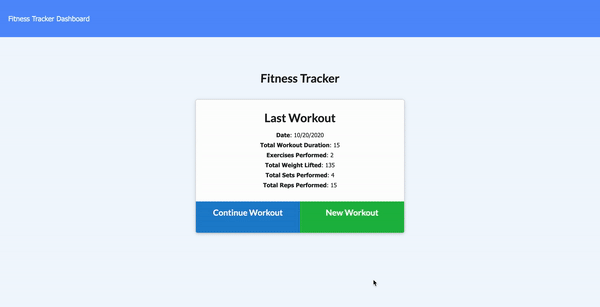
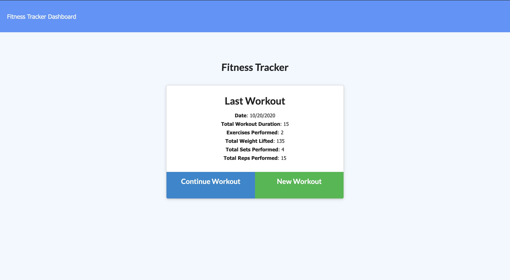

## Badges

## Description:
This is a command line application that can be used by a software engineering team. The application will prompt the user for information about the team manager and then information about the team members. The user can input any number of team members, and they may be a mix of engineers and interns. When the user has completed building the team, the application will create an HTML file that displays a nicely formatted team roster based on the information provided by the user.

## Topics:
- Models
- Express.js
    - HTTP Requests (GET, PUT, POST)
    - Routes and static content
- Node.js
- Backend API calls
- MongoDB

## Table of Contents
* [Description](#description)
* [Topics](#topics)
* [Installation](#installation)
* [Usage](#usage)
* [Contributing](#contributing)
* [Test](#test)
* [Challenges](#challenges)
* [Questions](#questions)
* [License](#license)
* [Author](#Author)
* [Badges](#badges)

## Installation
Before installing this application on your local computer, ensure that you have Node installed. This application works in Node. You can go to the following website to download Node: <a href='https://nodejs.org/en/'>Node</a>

    1. Clone the Git repository
        $ git clone <repo>
    2. Navigate to the directory and install the dependencies
        $ npm init to create package.json package
        $ npm install express mongo morgan

## Usage
Once all dependencies have been installed - run node server.js to launch the application. Go to localhost + the port number.

## Contributors
This application is open to anyone who wants to contribute or enhance the application. If you would like to contribute please reach out to me on Github or email.

## Test
There are no automatic test designed for this application. I ran manual test to make sure everything was working the way it should.
    - Clicked New Workout to add new workout to the dashboard.
    - After typing the new workout clicked add workout and complete to add the new workout to the dashboard.
    - Clicked the dashboard link to be taken to the dashboard were the workouts have been entered.

If you would like to design an automatic test for this application feel free to reach me on GitHub or Email

## Challenges
The build was easy due to the Front End boiler code that was provided. I needed to create the Back End code and connect to the MONGODB database that would hold our data and render it back to the user. 
    - I had a hard to connecting to the database, this was my first time working with mongo and connecting to it. I used the information provided in the supplemental folder to make connecting to the mongodb easier. Once I was able to connect to the database, the application functioned just as I envisioned it.

## Questions
If you have questions about this repository? Please contact me at [kamara.moses@yahoo.com](mailto:kamara.moses@yahoo.com). View more of my work in GitHub at [kamara-moses](https://github.com/kamara-moses).

## License
This repository is licensed under the MIT license.

Copyright (c) [2020] [Moses Kamara]

Permission is hereby granted, free of charge, to any person obtaining a copy of this software and associated documentation files (the 'Software'), to deal in the Software without restriction, including without limitation the rights to use, copy, modify, merge, publish, distribute, sublicense, and/or sell copies of the Software, and to permit persons to whom the Software is furnished to do so, subject to the following conditions:

The above copyright notice and this permission notice shall be included in all copies or substantial portions of the Software.

THE SOFTWARE IS PROVIDED 'AS IS', WITHOUT WARRANTY OF ANY KIND, EXPRESS OR IMPLIED, INCLUDING BUT NOT LIMITED TO THE WARRANTIES OF MERCHANTABILITY, FITNESS FOR A PARTICULAR PURPOSE AND NONINFRINGEMENT. IN NO EVENT SHALL THE AUTHORS OR COPYRIGHT HOLDERS BE LIABLE FOR ANY CLAIM, DAMAGES OR OTHER LIABILITY, WHETHER IN AN ACTION OF CONTRACT, TORT OR OTHERWISE, ARISING FROM, OUT OF OR IN CONNECTION WITH THE SOFTWARE OR THE USE OR OTHER DEALINGS IN THE SOFTWARE.

## Author 

